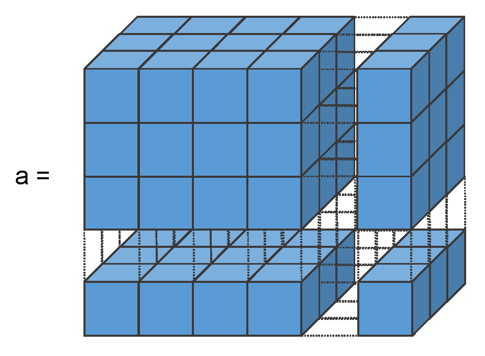

```{r setup, include=FALSE}
library(learnr)
library(knitr)
knitr::opts_chunk$set(echo = FALSE)
```

## Objektorientierung

Viele Fragestellungen erfordern komplexe Analysestrategien mit vielschichtigen Datenstrukturen und -verbindungen.

Diese gehen über die starren Möglichkeiten der üblichen Statistik-Pakete hinaus. Beispiel: z-Transformation in SPSS, mehrere Datensätze oder die Weiterverwendung von Ergebnissen.


## Klassen, Objekte und Methoden

Umdenken! R ist **objektorientiert**! Alles in R ist ein **Objekt**. Jedes Objekt gehört zu einer **Klasse** und mit jeder Klasse sind bestimmte **Methoden** (Funktionen) verbunden. Auch diese sind wiederum Objekte!

- Skalar
- Vektor
- Matrix
- Array
- Liste
- Dataframe


### Exercise with Code

```{r, out.width = "70%", fig.pos="h"}

```

*Here's an exercise with some prepopulated code as well as `exercise.lines = 5` to provide a bit more initial room to work.*

Now write a function that adds any two numbers and then call it:

```{r add-function, exercise=TRUE, exercise.lines = 5}
add <- function() {
  
}
```

## Topic 2

### Exercise with Hint

*Here's an exercise where the chunk is pre-evaulated via the `exercise.eval` option (so the user can see the default output we'd like them to customize). We also add a "hint" to the correct solution via the chunk immediate below labeled `print-limit-hint`.*

Modify the following code to limit the number of rows printed to 5:

```{r print-limit, exercise=TRUE, exercise.eval=TRUE}
mtcars
```

```{r print-limit-hint}
head(mtcars)
```

### Quiz

*You can include any number of single or multiple choice questions as a quiz. Use the `question` function to define a question and the `quiz` function for grouping multiple questions together.*

Some questions to verify that you understand the purposes of various base and recommended R packages:

```{r quiz}
quiz(
  question("Which package contains functions for installing other R packages?",
    answer("base"),
    answer("tools"),
    answer("utils", correct = TRUE),
    answer("codetools")
  ),
  question("Which of the R packages listed below are used to create plots?",
    answer("lattice", correct = TRUE),
    answer("tools"),
    answer("stats"),
    answer("grid", correct = TRUE)
  )
)
```

