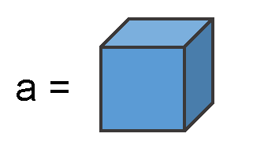
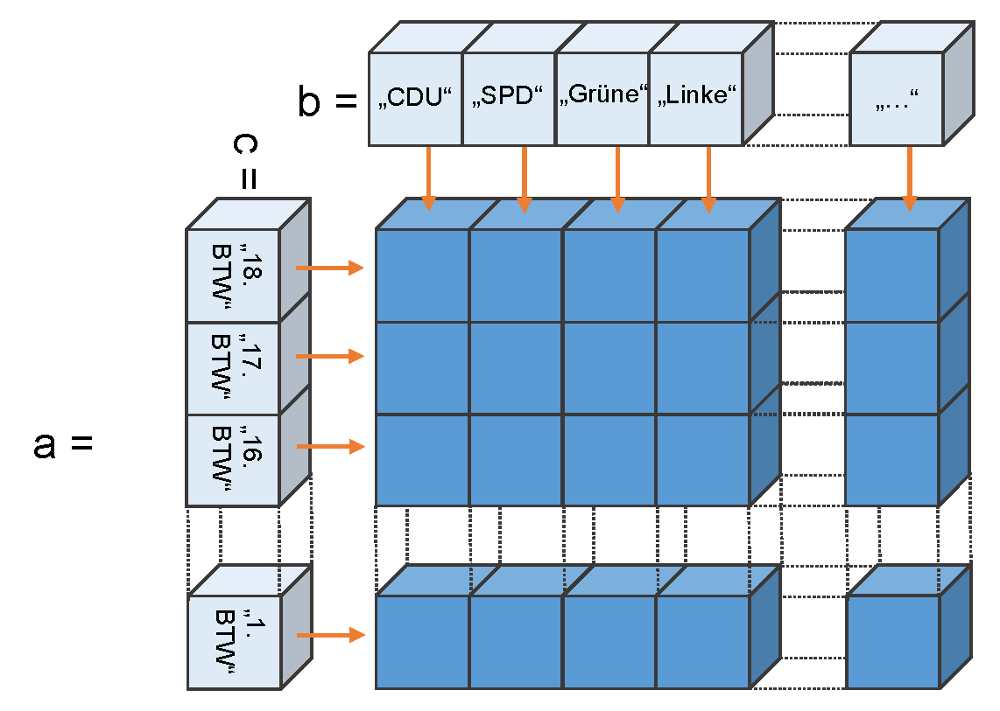

```{r setup, include=FALSE}
library(learnr)
library(MDAR)
library(knitr)
knitr::opts_chunk$set(echo = FALSE)
tutorial_options(exercise.cap = "Bitte eingeben")
```


```{r}
#party_results <- read.table("../0_data/view_election.csv",
#                            sep=",",
#                            dec=".",
#                            quote = "\"",
#                            header=T)

#head(party_results)
```

```{r setup_data}

#countrycodes <- read.table("../0_data/un_countrycodes.csv",
#                           sep=";",
#                           header=T)
#head(countrycodes)
#parties <- party_results[party_results$country_name_short %in% countrycodes$m49_code, ]

#parties <- party_results[(party_results$country_name_short== "DEU" & 
#                            party_results$election_type == "parliament" &
#                            as.Date(party_results$election_date) > as.Date("1989-12-31")), ]#
#
#parties$year <- substr(parties$election_date, 1,4)
#wahlergebnisse <- reshape2::dcast(parties, party_name_short ~ year, value.var= "vote_share")
#wahlergebnisse$party_name_short[2] <- "B90/Gr (Ost)"
#names(wahlergebnisse)

 
# ParlGov database (Döring and Manow 2019)
# 
# Döring, Holger and Philip Manow. 2019. Parliaments and governments database (ParlGov): Information on parties, elections and cabinets in modern democracies. Development version. http://www.parlgov.org, abgerufen am 02.11.2020.
# 
# 
# Country Codes 
# https://unstats.un.org/unsd/methodology/m49/
# 
# Pupulist Parties:
# https://popu-list.org/


#ess <- foreign::read.spss("../data/ESS9/ESS9e02.sav",,
#                          to.data.frame = TRUE,
#                          use.value.labels = FALSE)
#head(ess)
#ess$cntry

#names(attr(ess$cntry, "value.labels")) %in% countrycodes$country


#unique(ess$cntry)
```

# Grundlagen R - Objekte, Datenstrukturen und Indizierung

## Teil 1 - Datenstrukturen und Objekte

Zum Einstieg in die heutige Sitzung gibt es dieses interaktive Tutorial^[Das Tutorial wurde ebenfalls mit R und dem Paket [learnR](https://rstudio.github.io/learnr/) erstellt.], dass die Inhalte der letzten Woche wiederholt.   

Manchmal müssen Sie selbst den Code eingeben und ausführen, manchmal steht schon etwas drin, dass Sie ausführen sollen um sich den Output anzuschauen. Wenn Sie mal nicht weiter wissen, dann gibt es dort, wo Sie selbst überlegen müssen, immer auch einen Button, der Ihnen die Lösung anzeigt, oder zumindest einen Hinweis zeigt (Button `Hint` oder `Solution`).

```{r, out.width = "70%", fig.pos="h"}
include_graphics("./images/solution.png")
```


Letzte Woche haben wir grundlegende Datenstrukturen kennengelernt: *Skalar*, *Vektor*, *Matrix* und *Liste*.
Diese Datenstrukturen können Elemente der drei Basistypen *numeric*, *charakter* oder *logical* enthalten.

### Skalar
```{r, out.width = "20%", fig.pos="h"}

```

### Vektor
```{r, out.width = "35%", fig.pos="h"}
include_graphics("./images/Datenstruktur_Seite_05.png")
```

Erstellen Sie einen beliebigen Vektor der Länge 3.
```{r struktur1, exercise=TRUE}

```

<div id="struktur1-hint">
**Hinweis:** Denken Sie an den Zuwesieungspfeil und die `c()` Funktion. Vektoren und Matrizen dürfen immer nur Elemente des gleichen Typs enthalten.
</div>


### Matrix
```{r, out.width = "35%", fig.pos="h"}
include_graphics("./images/Datenstruktur_Seite_07.png")
```

Erstellen Sie zwei Vektoren mit 3 Elementen und fügen Sie sie reihenweise zu einer Matrix zusammen:
```{r struktur2, exercise=TRUE}

```

<div id="struktur2-hint">
**Hinweis:** Die Funktion `rbind()` fügt die Vektoren reihenweise zusammen, die Funktion `cbind()` spaltenweise. Beide Vektoren müssen aber den gleichen Datentyp beinhalten und die gleiche Länge aufweisen.
</div>


### List
```{r, out.width = "35%", fig.pos="h"}
include_graphics("./images/Datenstruktur_Seite_13.png")
```

Listen dürfen unterschiedliche Datenstrukturen mit unterschiedlichen Datenypen beinhalten. Ich habe Ihnen hier ein Listenobjekt angelegt: `wahlen`

Bitte rufen Sie das Objekt mal auf.

```{r struktur3-prepare}
wahlen <- list()
wahlen[[1]] <- c("Bundestagswahl", "Landtagswahl", "Kommunalwahl")

wahlen[[2]] <- rbind(c(rep("Angela Merkel", 3)),
                     c("Frank-Walter Steinmeier", "Peer Steinbrück", "Martin Schulz"))
  
  
wahlen[[3]] <- rbind(c(27.3, 34.1, 26.8),
                     c( 23.0, 25.7, 20.5))
dimnames(wahlen[[3]])[[1]]<- c("CDU", "SPD")
dimnames(wahlen[[3]])[[2]]<- c("2009","2013", "2017")
```

```{r struktur3, exercise=TRUE, exercise.setup = "struktur3-prepare" }

```

```{r struktur3-solution}
wahlen
```

Sie können jetzt eines der Listenelemente indizieren. Speichern Sie bitte aus der Liste das Element mit den Wahlergebnissen als neuen Vektor:

```{r struktur4, exercise=TRUE, exercise.setup = "struktur3-prepare" }

```

<div id="struktur3-hint">
**Hinweis:** Listen indiziert man mit der doppelten eckigen Klammer `[[]]`.
</div>


```{r struktur4-solution}
ergebnisse <- wahlen[[3]]
ergebnisse
```

Oft snd Listen groß und komplex. Sich die Liste anzeigen zu lassen, indem man das Objekt aufruft, ist daher oft unpraktisch. Listen (aber auch alle anderen Objekte ) lassen sich gut der Funktion `str()` in ihrer Struktur erkunden. Sie sehen also, aus was für Elementen die Liste besteht. Versuchen Sie es mal mit der Liste `wahlen` und schauen Sie sich den Output an. Vergleichen Sie bitte den Output mit dem von oben - wie werden die Datenstrukturen aus der Liste als `str()` dargestellt?

```{r struktur5, exercise=TRUE, exercise.setup = "struktur3-prepare" }
str(wahlen)
```


### Vektoren und Matrizen erstellen


Wir haben Vektoren mit der der Funktion `c()` erstellt und verlängert. Und wir haben Vektoren mit `cbind` und `rbind` zum Typ Matrix zusammengefügt. 


### Vektoren erstellen

Die folgende Tabelle enthält die Bundestagswahlergebnisse der CDU (ohne CSU) und der SPD für die Wahlen ab 1990.

Partei | 1990 | 1994 | 1998 | 2002 | 2005 | 2009 | 2013 | 2017
----|------|--------|-----|-----|------|-------|------|-------
CDU | 36.7| 34.2| 28.4| 29.5| 27.8| 27.3| 34.1| 26.8
SPD | 33.5| 36.4| 40.9| 38.5| 34.2| 23.0| 25.7| 20.5

Table: Bundestagswahlergebnisse CDU und SPD

Erstellen Sie je ein neues Objekt `SPD` und `CDU`, die jeweils die Wahlergebnisse enhalten.

```{r vektoren1, exercise=TRUE}

```

```{r vektoren1-solution}
SPD <- c(33.5, 36.4, 40.9, 38.5, 34.2, 23.0, 25.7, 20.5)
CDU <- c(36.7, 34.2, 28.4, 29.5, 27.8, 27.3, 34.1, 26.8)
```

Dann können wir die Objekte abrufen: 
```{r vektoren3, exercise=TRUE, exercise.setup = "vektoren1-solution" }
SPD 
CDU
```

Oder einfache Funktionen mit den Vektoren nutzen:

```{r vektoren4, exercise=TRUE, exercise.setup = "vektoren1-solution" }
length(CDU)
mean(SPD)
max(CDU)
min(SPD)
```

Ode Vergleiche durchführen... Erstellen Sie doch mal eine neue Variable (Objekt/Vektor) mit Namen `cdu.gewinnt`, der die Information enthält, ob die CDU bei einer Wahl über der SPD lag:

```{r vektoren5, exercise=TRUE, exercise.setup = "vektoren1-solution" }

```

```{r vektoren5-solution}
cdu.gewinnt <- CDU > SPD
cdu.gewinnt
```


Oder man kann die Vektoren für weitere Berechnungen heranziehen. Zum Beispiel lässt sich die Differenz zwischen den Wahlergebnissen berechnen:

```{r vektoren6, exercise=TRUE, exercise.setup = "vektoren1-solution" }
btw.diff <- CDU - SPD
btw.diff
```

Das neue Objekt `btw.diff` enthält also für jede Wahl, um wie viele Prozentpunkte die CDU über der SPD lag (weil CDU minus SPD).


### Mit `names()` beschriften

Mit der Funktion `names()` lassen sich diese Vektoren auch beschriften. 

```{r, out.width = "35%", fig.pos="h"}
include_graphics("./images/Datenstruktur_Seite_18.png")
```

```{r, out.width = "35%", fig.pos="h"}

```


Hier macht es zum Beispiel Sinn, die Jahreszahl als Beschriftung zu nutzen:

```{r vektoren}
SPD <- c(33.5, 36.4, 40.9, 38.5, 34.2, 23.0, 25.7, 20.5)
CDU <- c(36.7, 34.2, 28.4, 29.5, 27.8, 27.3, 34.1, 26.8)
```


```{r exc_names1, exercise=TRUE, exercise.setup = "vektoren"}
names(CDU) <- c(1990, 1994, 1998, 2002, 2005, 2009, 2013, 2017)
CDU
```

Oder wir erstellen ein Objekt `jahre` und nutzen dieses zur Beschriftung:

```{r exc_names2, exercise=TRUE, exercise.setup = "vektoren"}
jahre <- c(1990, 1994, 1998, 2002, 2005, 2009, 2013, 2017)
names(SPD) <- jahre
SPD
```

### Beschriftung ausgeben lassen

Wenn wir jetzt Funktionen wie `which()`, `min()`, oder `max()` auf diese Vektoren anwenden, dann bekommen wir nicht nur ausgegeben, das wievielte Element die Bedingung erfüllt, sondern auch, die dazugehörige Beschriftung. Um präziser zu sein: nicht nur das n-te Element, sondern auch das n-te Element aus dem names()-Vektor des Objektes.

Versuchen Sie doch mal, für das Objekt `SPD` mit der `which()`-Funktion herauszufinden, in welchem Jahr die SPD das schlechteste Wahlergebnis erhalten hat:

```{r which-min-prepare}
SPD <- c(33.5, 36.4, 40.9, 38.5, 34.2, 23.0, 25.7, 20.5)
CDU <- c(36.7, 34.2, 28.4, 29.5, 27.8, 27.3, 34.1, 26.8)
jahre <- c(1990, 1994, 1998, 2002, 2005, 2009, 2013, 2017)
names(CDU) <- jahre
names(SPD) <- jahre
```


```{r min_exec1, exercise=TRUE,  exercise.setup = "which-min-prepare"}

```


```{r min_exec1-solution}
which(SPD==min(SPD))
```

Und jetzt bitte, in welchem Jahr die SPD ein Ergebnis hatte, das über oder gleich dem Ergebnis der CDU lag:

```{r which_exec1, exercise=TRUE,  exercise.setup = "which-min-prepare"}

```


```{r which_exec1-solution}
which(SPD >= CDU)
```

Oder nutzen Sie zusätzlich die `mean()`-Funktion um zu prüfen, in welchen Jahren d SPD überdruchschnittlich 


## Teil 2 - Funktionen

Wir haben schon einige Funktionen kennengerlernt...

### Funktionen zur Abreit mit Objekten

Hier sind einige Funktionen die wir genutzt haben, um mit Objekten zu arbeiten:

Funktionsaufruf | Was die Funktion ausgibt
------------|--------------------
length(object) | Number of elements/components.
dim(object) | Dimensions of an object.
str(object) | Structure of an object.
names(object) | Names of components in an object.
c(object, object,...) | Combines objects into a vector.
cbind(object, object, ...) | Combines objects as columns.
rbind(object, object, ...) | Combines objects as rows.
head(object) | Lists the first part of the object.
tail(object) | Lists the last part of the object.

Table: Funktionen für die Arbeit mit Objekten (nach Kabacoff, 2011: 43)


### Mathematische und statistische Funktionen

Dann gab es einige mathematische, bzw. statistische Funktionen:

Funktionsaufruf | Was die Funktion ausgibt
------------|--------------------
abs(object) | Absolute Werte (Betrag)
sqrt(object) | Quadratwurzel
log(object) | Logarithmus
sum(object) | Summe der Elemente eines Objektes
cumsum(object) | Kummulierte Summe
mean(object) | Arithmetisches Mittel
sd(object) | Standardabweichung
table(object) | Häufigkeitstabelle
prop.table(table(object)) | Tabelle mit relativen Häufigkeiten


### Vergleichoperatoren

Und wir haben einige Operatoren kennengelernt, um Vergleiche vorzunehmen:

Operator | Vergleich
----|---------
< | Less than
<= | Less than or equal to
\> | Greater than
\>= | Greater than or equal to
== | Exactly equal to
!= | Not equal to
!x | Not x
x \| y | x or y
x & y |x and y
isTRUE(x) | Test if x is TRUE

Table: Operatoren für Vergleiche (vgl. Kabacoff, 2011: 77)

Diese Vergleichoperatoren sind vor allem beim Indizieren (also beim Subsetting von Objekten) wichtig. 
Damit beschäftigen wir uns jetzt im dritten Teil des Tutorials.

## Teil 3 - Indizieren

Um das Indizieren zu verstehen ist muss man wissen, dass beim Indizieren ausgewählt wird, was `TRUE` ist.

Rufen Sie mal Vektor `a` auf, den ich bereits vorbereitet habe: 

```{r indizieren-prepare}
a <- c(1:15)
```

```{r indizieren1, exercise=TRUE,  exercise.setup = "indizieren-prepare"}
a
```

### Einfaches Indizieren

Wenn man nun idizieren möchte, dann kann man in der eckigen Klammer direkt angeben, das wievielte Element man haben möchte - oder auch mehrere, dann mit `c()`:

```{r indizieren2, exercise=TRUE,  exercise.setup = "indizieren-prepare"}
a[5] # das 5. Element
a[c(2,4,6)] # das 2.,4. und 6. Element
```


### Indizieren mit Bedingungen

...oder Sie können eine Bedingung angeben, die erfüllt sein muss, z.B. hier >= 12. 

Wenn Sie aber nur schreiben `a >= 12`, dann bekommen Sie nicht das Subset zurück, sondern einen Vektor, der genau so lang ist, wie Vektor `a`, der die Information enthält, ob `a` die Bedingugn `>= 12` erfüllt (einen Vektor vom Typ `logical`, also mit `TRUE` oder `FALSE`).

```{r indizieren3, exercise=TRUE,  exercise.setup = "indizieren-prepare"}
a >= 12
```

Will man nur das Subset haben, dann wird diese logische Information `TRUE` oder `FALSE` genutzt, um R mitzuteilen, welches Element aus dem Vektor ausgegeben werden soll:
```{r indizieren4, exercise=TRUE,  exercise.setup = "indizieren-prepare"}
welches.element <- a >= 12 #Erstellt den Velktor mit TRUE oder FALSE
a[welches.element] # Nutzt den TRUE/FALSE Vektor zum Indizieren
```

Es geht aber auch direkt... Aber jetzt wissen Sie, warum `a` für die Bedingung auch nochmal in der eckigen Klammer gennant werden muss:

```{r indizieren5, exercise=TRUE,  exercise.setup = "indizieren-prepare"}
a[a >= 12]
```

Dabei muss aber der logische Vektor gleich lang sein, wie der ursprüngliche Vektor.

### Indizieren mit Zuweisung

Das gleiche gilt auch, wenn Sie für indizierte Objekte (Subsets eines Objektes) eine neue Zweisung vornehmen möchten:

> Soll den Objekten, die durch Indizierung ausgewählt werden neue Werte zugewiesen werden, dann müssen auf beiden Seiten des Zuweisungspfeils `<-` gleich viele Objekte vorhanden sein 

Nehmen wir folgenden Vektor mit Regierungskoalitionen `koalitionen`: 

```{r indizieren2-prepare}
koalitionen <- c("CDU/CSU und SPD", "CDU/CSU und FDP", "CDU/CSU und SPD")   
names(koalitionen) <- c(2009, 2013, 2017)
koalitionen
```                 
   

```{r indizieren6, exercise=TRUE,  exercise.setup = "indizieren2-prepare"}
koalitionen <- c("CDU und SPD", "CDU und FDP", "CDU/CSU und SPD")   
names(koalitionen) <- c(2009, 2013, 2017)
koalitionen
```

Nehmen wir an, wir wollen nun auch für Element 1 und 2 die CSU dazuschreiben, indizieren wir also die ersten beiden Elemente:

Übrigens: Wir könnten auch Beschriftungen (also die `names()`) für die Indierung nutzen:

```{r indizieren7, exercise=TRUE,  exercise.setup = "indizieren2-prepare"}
koalitionen[c(1,2)]
koalitionen[c("2009", "2013")]
```

Diese ersten beiden Elemente wollen wir nun korrigieren und die CSU auch nennen. Dazu werden die ersten beiden Elemente durch den Zuweisungspfiel überschrieben:

```{r indizieren8, exercise=TRUE,  exercise.setup = "indizieren2-prepare"}
koalitionen[c("2009", "2013")] <- c("CDU/CSU und SPD", "CDU/CSU und FDP")
```


### Indizieren einer Matrix

Bitte schauen Sie sich die folgende Tabelle an:


```{r tab}
auswahl <- c("CDU", "CSU", "SPD", "FDP", "B90/Gru", "PDS|Li")
knitr::kable(wahlergebnisse[wahlergebnisse$party_name_short %in% auswahl,],
             row.names = FALSE)
```

```{r btw-prepare, exercise=FALSE}
wahlen <- as.matrix(wahlergebnisse[wahlergebnisse$party_name_short %in% auswahl, c(2:9)])
dimnames(wahlen) <- NULL
```

Ich habe bereits für jede Partei einen Vektor erstellt und diese mit `rbind()` zu einer Matrix zusammengefügt. Sie können das Matrix-Objekt mit dem Namen `wahlen` aufrufen: 

```{r mat1, exercise=TRUE,  exercise.setup = "btw-prepare"}
wahlen
```


Jetzt sind Sie dran: bitte beschriften Sie die Matrix mit Parteinamen und Jahreszahlen mithilfe der `dimnames()` Funktion. Die Funktion `dimnames()` muss für die Zeilenbeschriftung mit `dimnames()[[1]] <- ...` und für die Spaltenbeschriftung mit `dimnames()[[2]] <- ...` genutzt werden.

```{r mat2, exercise=TRUE,  exercise.setup = "btw-prepare"}

```

```{r mat2-solution}
partei <- c("B90/Gru", "CDU", "CSU", "FDP", "PDS|Li", "SPD") 
jahr <- c(1990, 1994, 1998, 2002, 2005, 2009, 2013, 2017)
dimnames(wahlen)[[1]] <- partei  # Zeilen beschriften
dimnames(wahlen)[[2]] <- jahr  # Spalten beschriften
wahlen #Objekt aufrufen
```


Leider hat sich ein Fehler eingeschlichen. 1990 sind die Grünen in Ost und West getrennt angetreten. In Ostdeutschland gab es das *Bündnis 90/Grüne-BürgerInnenbewegungen*. Diese haben 1,2 Prozent geholt. Das muss dem Ergebnis der Grünen hinzugerechnet werden.

Bitte nutzen Sie die Indizierung, um das Ergebnis der Grünen 1990 in der Matrix zu korrigieren.


```{r btw-prepare1}
wahlen <- as.matrix(wahlergebnisse[wahlergebnisse$party_name_short %in% auswahl, c(2:9)])
partei <- c("B90/Gru", "CDU", "CSU", "FDP", "PDS|Li", "SPD") 
jahr <- c(1990, 1994, 1998, 2002, 2005, 2009, 2013, 2017)
dimnames(wahlen)[[1]] <- partei
dimnames(wahlen)[[2]] <- jahr
```

```{r mat3, exercise=TRUE,  exercise.setup = "btw-prepare1"}

```


```{r mat3-solution}
wahlen["B90/Gru","1990"] <- wahlen["B90/Gru","1990"] + 1.2

# Alternativ
wahlen[1,1] <- wahlen[1,1] + 1.2

# Geht auch gemischt, ist aber kein guter Stil
wahlen[1,"1990"] <- wahlen["B90/Gru",1] + 1.2
```


Bitte erstellen Sie eine neue Matrix mit dem Namen `wahlen2` auf Basis der bestehenden Matrix. Sie soll eine zuätzliche Zeile in enthalten, die das gemeinsame Ergebnis für die CDU/CSU enthält. 


```{r mat4, exercise=TRUE,  exercise.setup = "btw-prepare1"}

```


```{r mat4-solution}
# Denken Sie daran, dass wir, wenn wir eine ganze Zeile indizieren wollen
# die zweite Angabe in der eckigen Klammer (nach dem Komma) leer bleiben muss.

CDU_und_CSU <- wahlen["CDU",] + wahlen["CSU",] 
# Oder
# CDU_und_CSU <- wahlen[2,] + wahlen[3,] 

wahlen2 <- rbind(wahlen, CDU_und_CSU)
wahlen2
```


Jetzt sollen Sie dieses neue Objekt `wahlen2` nutzen, um zu berechnen, wie viel Prozent Stimmanteil sonstige Parteien erhalten haben. Denken Sie daran, dass Sie jetzt nicht `CDU` und `CSU` oder `CDUundCSU` gleichzeitig nutzen dürfen, sondern durch Indizierung ausschließen müssen.

```{r btw-prepare2}
wahlen <- as.matrix(wahlergebnisse[wahlergebnisse$party_name_short %in% auswahl, c(2:9)])
partei <- c("B90/Gru", "CDU", "CSU", "FDP", "PDS|Li", "SPD") 
jahr <- c(1990, 1994, 1998, 2002, 2005, 2009, 2013, 2017)
dimnames(wahlen)[[1]] <- partei
dimnames(wahlen)[[2]] <- jahr
CDU_und_CSU <- wahlen["CDU",] + wahlen["CSU",] 
wahlen2 <- rbind(wahlen, CDU_und_CSU)
```

```{r mat5, exercise=TRUE,  exercise.setup = "btw-prepare2"}

```

```{r mat5-solution}
gesamt.pro.wahl <- c(sum(wahlen[c(1:6),1]),
                     sum(wahlen[c(1:6),2]),
                     sum(wahlen[c(1:6),3]),
                     sum(wahlen[c(1:6),4]),
                     sum(wahlen[c(1:6),5]),
                     sum(wahlen[c(1:6),6]),
                     sum(wahlen[c(1:6),7]),
                     sum(wahlen[c(1:6),8]))
sonstige <- 100 - gesamt.pro.wahl
sonstige
```

Wenn Sie die Musterlösung gesehen haben, werden Sie sicher denken: das muss doch auch einfacher gehen. Ja: Alternativ können Sie die Funktion `colSums()` nutzen um Spaltenweise Summen zu berechnen (und ja, es gibt auch die Funktion `rowSums()`):

```{r mat6, exercise=TRUE,  exercise.setup = "btw-prepare2"}
gesamt.pro.wahl <- colSums(wahlen2[c(1:6),])
sonstige <- 100 - gesamt.pro.wahl
sonstige 

# Oder direkt die sonstigen berechnen:
sonstige <- 100 - colSums(wahlen2[c(1:6),])
sonstige
```


Übrigens, Sie können beim Indizieren auch mit einem Minus ausschließen:

```{r mat7, exercise=TRUE,  exercise.setup = "btw-prepare2"}
# Schließt die 7. Zeile aus
wahlen2[-c(7),]
# Schließt die 2. und 3 Zeile aus
wahlen2[-c(2,3),]
```


## Schluss

Sie sind fertig mit dem Tutorial zu den Grundlagen. Im nächsten Schritt werden wir sehen, wie man Daten in R einliest und wie man mit **Dataframes** arbeitet. Dazu gibt es in ILIAS ein Lernmodul: https://ilias3.uni-stuttgart.de/goto_Uni_Stuttgart_copa_2209483.html
